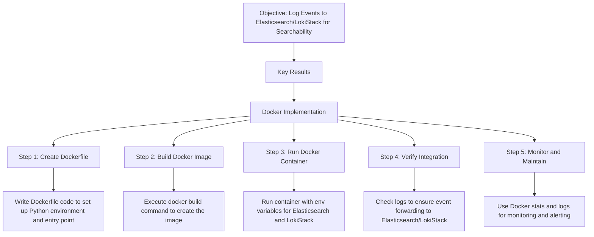

Here's a Mermaid diagram to illustrate the steps of implementing the Docker solution to log  events to Elasticsearch/LokiStack. Following that is a brief explanation of each step.

# ROADMAP

# REFERENCES
### Explanation of Each Step

1. **Create Dockerfile**: A `Dockerfile` is created with instructions to set up a Python environment, install dependencies, and set up an entry point for logging OpenShift events. The file also exposes the necessary ports for Elasticsearch (9200) and LokiStack (3100).

2. **Build Docker Image**: Using the Dockerfile, a Docker image is created with the command `docker build -t openshift-logging:latest .`. This image contains everything needed to log events to Elasticsearch and LokiStack.

3. **Run Docker Container**: The Docker container is started with the required environment variables to connect to the Elasticsearch and LokiStack hosts, and it forwards data to the designated ports.

4. **Verify Integration**: Logs from the Docker container are checked to confirm that OpenShift events are being successfully sent to Elasticsearch/LokiStack.

5. **Monitor and Maintain**: Finally, Docker stats and logs are used to monitor the container's performance and ensure that event logging remains operational. This step includes setting up alerts as needed.