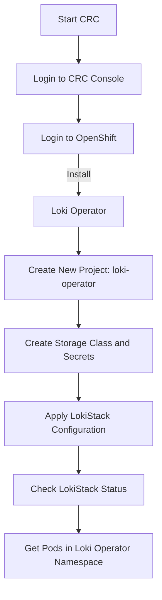

# CRC Loki Operator Setup Process

The following flowchart outlines the steps for setting up the Loki Operator on CRC (CodeReady Containers) and OpenShift.

## Steps Explained

1. **Start CRC**: Begin by starting the CodeReady Containers environment.
2. **Login to CRC Console**: Access the CRC console.
3. **Login to OpenShift**: Authenticate into OpenShift to enable configuration and deployment.
4. **Install Loki Operator**: Proceed with installing the Loki Operator on OpenShift.
5. **Create New Project**: Set up a new project dedicated to the Loki Operator, often named `loki-operator`.
6. **Create Storage Class and Secrets**: Define the necessary storage class and configure secrets for the Loki Operator.
7. **Apply LokiStack Configuration**: Implement the configuration settings for LokiStack.
8. **Check LokiStack Status**: Verify the LokiStack deployment status to ensure everything is functioning.
9. **Get Pods in Loki Operator Namespace**: List the pods in the Loki Operator's namespace to confirm successful deployment.

---

This guide should streamline your Loki Operator setup on CRC and OpenShift.